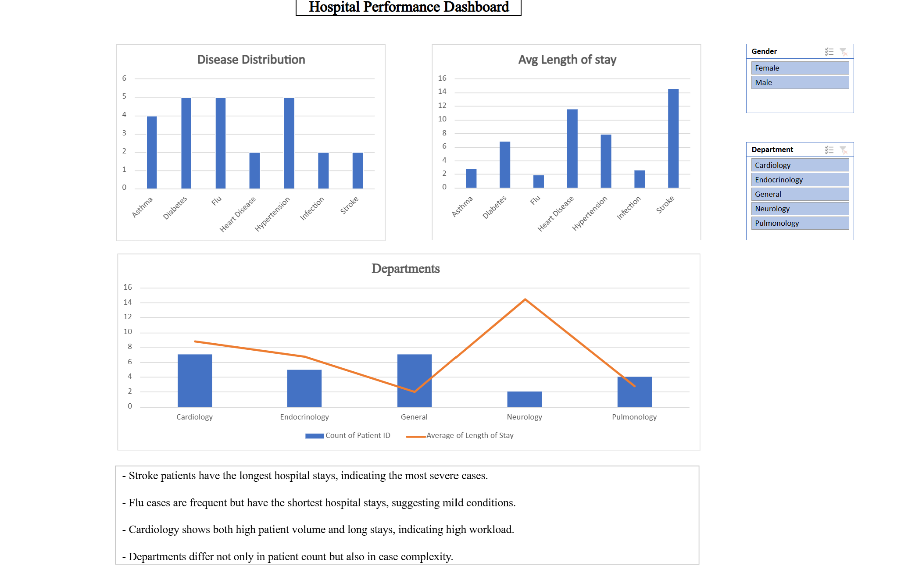

# hospital-performance-dashboard

This project analyzes hospital data to evaluate patient distribution, department workload, and case severity.

---

## Tools Used:
- Microsoft Excel
- Pivot Tables
- Data Visualization

---

## Project Features:
- Interactive dashboard
- Disease distribution analysis
- Department workload analysis
- Average length of stay analysis
- Slicers for filtering (Gender, Department)

---

## Key Insights:
- Stroke patients have the longest hospital stays, indicating the most severe cases.
- Flu cases are frequent but have the shortest stays, suggesting mild conditions.
- Cardiology shows both high patient volume and long stays, indicating high workload.
- Departments differ not only in patient count but also in case complexity.

---

## Dashboard Preview:

---

## Files Included:
- Hospital Dashboard.xlsx

---

## Author:
Ghala M 
